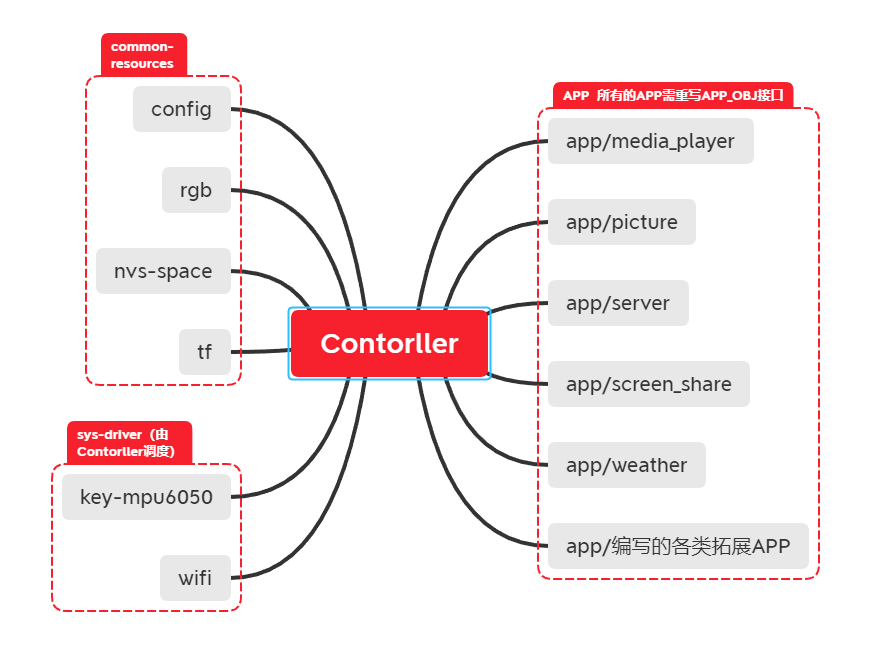
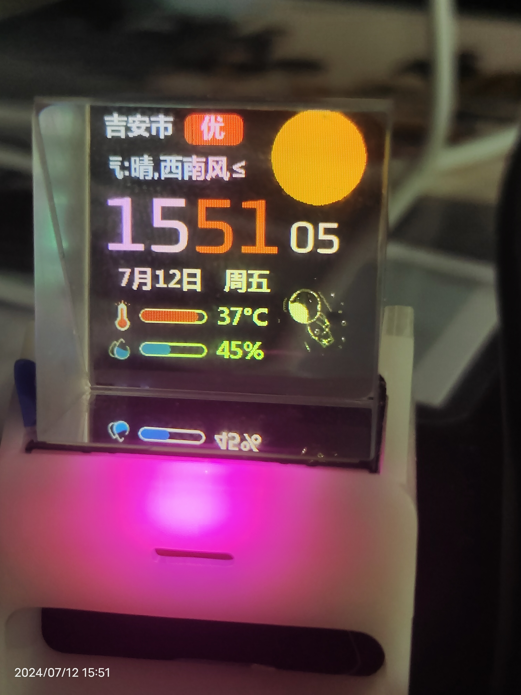

## 声明 
**此项目是B站遛马小哥的作品，我跟着B站up藏宝室制作，上传到github只为学习代码**

## 架构框图


### APP结构体分析
#### **接口**
下面是APP的结构体为了分析简便适当删除
一个APP主要组成部分是
* app_image(它展示的图标)
* app_init(调度中心调度该APP前执行的初始化操作)
* main_process(该APP运行的主要逻辑)
* exit_callback(调度中心离开该APP时调度)
```C++
struct APP_OBJ
{
    // APP的图片存放地址    APP应用图标 128*128
    const void *app_image;

    // APP的初始化函数 也可以为空或什么都不做（作用等效于arduino setup()函数）
    int (*app_init)(AppController *sys);

    // APP的主程序函数入口指针
    void (*main_process)(AppController *sys,
                         const ImuAction *act_info);

    // 退出之前需要处理的回调函数 可为空
    int (*exit_callback)(void *param);

};
```
每个APP都以一个.c和.h文件形式存放在app文件夹下
.c文件编写上述的函数实现，并且在最后创建一个APP全局变量结构体
```C++
APP_OBJ weather_app = {WEATHER_APP_NAME, &app_weather, "",
                       weather_init, weather_process, weather_background_task,
                       weather_exit_callback, weather_message_handle};
```
.h文件引用APP接口文件，并将APP变量声明出去
```C++
#include "sys/interface.h"

extern APP_OBJ weather_app;
```
最后再创建一个app_conf.h文件负责管理所有APP的开启/关闭(条件编译)
```C++
// 纪念日APP
#define APP_ANNIVERSARY_USE 1
#if APP_ANNIVERSARY_USE
#include "app/anniversary/anniversary.h"
#endif
```
#### **APP添加到程序调度中心**
```C++
//初始化所有注册的app
    app_controller->init();

    // 将APP"安装"到controller里
#if APP_WEATHER_USE
    app_controller->app_install(&weather_app);
#endif
#if APP_WEATHER_OLD_USE
    app_controller->app_install(&weather_old_app);
#endif
#if APP_PICTURE_USE
    app_controller->app_install(&picture_app);
#endif
#if APP_MEDIA_PLAYER_USE
    app_controller->app_install(&media_app);
#endif
#if APP_SCREEN_SHARE_USE
    app_controller->app_install(&screen_share_app);
#endif
#if APP_FILE_MANAGER_USE
    app_controller->app_install(&file_manager_app);
#endif

    app_controller->app_install(&server_app);

#if APP_IDEA_ANIM_USE
    app_controller->app_install(&idea_app);
#endif
#if APP_BILIBILI_FANS_USE
    app_controller->app_install(&bilibili_app);
#endif
#if APP_SETTING_USE
    app_controller->app_install(&settings_app);
#endif
#if APP_GAME_2048_USE
    app_controller->app_install(&game_2048_app);
#endif
#if APP_ANNIVERSARY_USE
    app_controller->app_install(&anniversary_app);
#endif
#if APP_HEARTBEAT_USE
    app_controller->app_install(&heartbeat_app, APP_TYPE_BACKGROUND);
#endif
#if APP_STOCK_MARKET_USE
    app_controller->app_install(&stockmarket_app);
#endif
#if APP_PC_RESOURCE_USE
    app_controller->app_install(&pc_resource_app);
#endif
```
#### **调度中心如何管理APP**
详见controller分析的main_process类成员函数

### Controller分析
#### **Controller类分析**
```C++
class AppController
{
public:
    /*构造函数和析构函数*/
    AppController(const char *name = CTRL_NAME);
    ~AppController();
    /*初始化函数*/
    void init(void);
    /*与APP有关的函数*/
    // 将APP注册到app_controller中
    int app_install(APP_OBJ *app,
                    APP_TYPE app_type = APP_TYPE_REAL_TIME);
    // 将APP从app_controller中卸载（删除）
    int app_uninstall(const APP_OBJ *app);
    int main_process(ImuAction *act_info);
    void app_exit(void); // 提供给app退出的系统调用

private:
    APP_OBJ *appList[APP_MAX_NUM];      // 预留APP_MAX_NUM个APP注册位
    APP_TYPE appTypeList[APP_MAX_NUM];  // 对应APP的运行类型
    /*一些标志位*/
    unsigned int app_num;
    boolean app_exit_flag; // 表示是否退出APP应用
    int cur_app_index;     // 当前运行的APP下标
    int pre_app_index;     // 上一次运行的APP下标

    TimerHandle_t xTimerEventDeal; // 事件处理定时器

public:
    SysUtilConfig sys_cfg;
    SysMpuConfig mpu_cfg;
    RgbConfig rgb_cfg;
};
```
#### **contoller构造函数和析构函数**
```C++
AppController::AppController(const char *name)
{
    //类内成员标志初始化
    app_num = 0;
    app_exit_flag = 0;
    cur_app_index = 0;
    pre_app_index = 0;

    m_wifi_status = false;
    m_preWifiReqMillis = GET_SYS_MILLIS();

    //freertos的定时器
    //这里定义了一个周期为300ms的周期性定时器
    xTimerEventDeal = xTimerCreate("Event Deal",
                                   300 / portTICK_PERIOD_MS,
                                   pdTRUE, (void *)0, eventDealHandle);
    xTimerStart(xTimerEventDeal, 0);
}
```
#### **contoller的init函数**
```C++
void AppController::init(void)
{
    // 设置CPU主频
    if (1 == this->sys_cfg.power_mode)
    {
        setCpuFrequencyMhz(240);
    }
    else
    {
        setCpuFrequencyMhz(80);
    }
    //lvgl的init
    app_control_gui_init();
    //添加一个loadingAPP并显示就是一个转圈的图片,gui_init和display_scr都是lvgl有关的
    appList[0] = new APP_OBJ();
    appList[0]->app_image = &app_loading;
    appList[0]->app_name = "Loading...";
    appTypeList[0] = APP_TYPE_REAL_TIME;
    //就是加载这个APP的图标和名字
    app_control_display_scr(appList[cur_app_index]->app_image,
                            appList[cur_app_index]->app_name,
                            LV_SCR_LOAD_ANIM_NONE, true);
   
}
```
#### **controller的app_install函数**
```C++
int AppController::app_install(APP_OBJ *app, APP_TYPE app_type)
{
    appList[app_num] = app;
    appTypeList[app_num] = app_type;
    ++app_num;
    return 0; // 安装成功
}
```
#### **controller的main_process**
**整个程序最重要的执行逻辑**
```C++
int AppController::main_process(ImuAction *act_info)
{
    if (0 == app_exit_flag)//并未进入任何APP
    {
        //根据MPU6050的动作
        //向左向右偏转->变换当前的APPindex并显示图标
        //向前->执行APP结构体内初始化函数
        lv_scr_load_anim_t anim_type = LV_SCR_LOAD_ANIM_NONE;
        if (ACTIVE_TYPE::TURN_LEFT == act_info->active)
        {
            anim_type = LV_SCR_LOAD_ANIM_MOVE_RIGHT;
            pre_app_index = cur_app_index;
            cur_app_index = (cur_app_index + 1) % app_num;
            Serial.println(String("Current App: ") + appList[cur_app_index]->app_name);
        }
        else if (ACTIVE_TYPE::TURN_RIGHT == act_info->active)
        {
            anim_type = LV_SCR_LOAD_ANIM_MOVE_LEFT;
            pre_app_index = cur_app_index;
            cur_app_index = (cur_app_index - 1 + app_num) % app_num; 
            Serial.println(String("Current App: ") + appList[cur_app_index]->app_name);
        }
        else if (ACTIVE_TYPE::GO_FORWORD == act_info->active)
        {
            app_exit_flag = 1; // 进入app
            if (NULL != appList[cur_app_index]->app_init)
            {
                (*(appList[cur_app_index]->app_init))(this); // 执行APP初始化
            }
        }
        //如果不是进入APP就刷新图标
        if (ACTIVE_TYPE::GO_FORWORD != act_info->active) // && UNKNOWN != act_info->active
        {
            app_control_display_scr(appList[cur_app_index]->app_image,
                                    appList[cur_app_index]->app_name,
                                    anim_type, false);
            vTaskDelay(200 / portTICK_PERIOD_MS);
        }
    }
    else//如果已经进入了APP
    {
        //将MPU6050的动作交给APP运行逻辑判断，controller只负责调用APP的运行逻辑程序
        app_control_display_scr(appList[cur_app_index]->app_image,
                                appList[cur_app_index]->app_name,
                                LV_SCR_LOAD_ANIM_NONE, false);
        // 运行APP进程 等效于把控制权交给当前APP
        (*(appList[cur_app_index]->main_process))(this, act_info);
    }
    act_info->active = ACTIVE_TYPE::UNKNOWN;
    act_info->isValid = 0;
    return 0;
}
```
### mpu6050分析

#### mpu6050动作姿态
mpu6050的初始化和动作检测基本都是MPU6050库的工作就不详述了
#### mpu6050检测逻辑
```C++
1.创建一个MPU6050的周期性定时器，在setup()结束之后就开始启动
xTimerAction = xTimerCreate("Action Check",
                                200 / portTICK_PERIOD_MS,
                                pdTRUE, (void *)0, actionCheckHandle);
xTimerStart(xTimerAction, 0);
2.周期定时器调用的任务，其实就是置标志位
void actionCheckHandle(TimerHandle_t xTimer)
{
    // 标志需要检测动作
    isCheckAction = true;
}
3.在主循环函数中根据标志位检测动作然后由controller判断
void loop()
{

    if (isCheckAction)
    {
        isCheckAction = false;
        act_info = mpu.getAction();
    }
    app_controller->main_process(act_info); // 运行当前进程
}
```


## APP分析
### 图片APP

#### **初始化**
```C++
static int picture_init(AppController *sys)
{
	//初始化一个img对象并添加样式
    photo_gui_init();
    /*初始化运行参数*/
    read_config(&cfg_data);
    run_data = (PictureAppRunData *)malloc(sizeof(PictureAppRunData));
    run_data->pic_perMillis = 0;
    run_data->image_file = NULL;
    run_data->pfile = NULL;
    run_data->image_pos_increate = 1;
    run_data->image_file = tf.listDir(IMAGE_PATH);
    if (NULL != run_data->image_file)
    {
        run_data->pfile = get_next_file(run_data->image_file->next_node, 1);
    }
    /*TJPG库的设置*/
    // The jpeg image can be scaled by a factor of 1, 2, 4, or 8
    TJpgDec.setJpgScale(1);//按系数缩放
    // The decoder must be given the exact name of the rendering function above
    TJpgDec.setCallback(tft_output);//jpg格式文件用TFT库函数显示
    return 0;
}
```
#### **运行逻辑**
```C++
static void picture_process(AppController *sys,
                            const ImuAction *act_info)
{
    lv_scr_load_anim_t anim_type = LV_SCR_LOAD_ANIM_FADE_ON;
    //如果是退出就由controller调用图片APP的退出函数
    if (RETURN == act_info->active)
    {
        sys->app_exit();
        return;
    }
    //image_pos_increate控制图片文件的寻找方向
    //refreshFlag意味着本次运行中是否要显示其他图片
    if (TURN_RIGHT == act_info->active)
    {
        anim_type = LV_SCR_LOAD_ANIM_OVER_RIGHT;
        run_data->image_pos_increate = 1;
        run_data->refreshFlag = true;
    }
    else if (TURN_LEFT == act_info->active)
    {
        anim_type = LV_SCR_LOAD_ANIM_OVER_LEFT;
        run_data->image_pos_increate = -1;
        run_data->refreshFlag = true;
    }
    //如果没插SD卡，controller可以调用图片APP的初始化函数
    //但是每次运行到这都会退出，所以实际上看起来就是压根没有进入APP
    if (NULL == run_data->image_file)
    {
        sys->app_exit();
        return;
    }

    // 自动切换的时间检测
    if (0 != run_data->image_pos_increate &&
        0 != cfg_data.switchInterval &&
        GET_SYS_MILLIS() - run_data->pic_perMillis >= cfg_data.switchInterval)
    {
        run_data->refreshFlag = true;
    }
    //刷新显示
    //.jpg格式图片用TJPG库解码并用TFT库函数显示
    //.bin格式图片用LVGL库函数显示
    if (true == run_data->refreshFlag)
    {
        if (NULL != run_data->image_file)
        {
            run_data->pfile = get_next_file(run_data->pfile,
                                            run_data->image_pos_increate);
        }
        if (NULL != strstr(file_name, ".jpg") || NULL != strstr(file_name, ".JPG"))
        {
            // 直接解码jpg格式的图片
            TJpgDec.drawSdJpg(0, 0, file_name);
        }
        else if (NULL != strstr(file_name, ".bin") || NULL != strstr(file_name, ".BIN"))
        {
            // 使用LVGL的bin格式的图片
            display_photo(file_name, anim_type);
        }
        run_data->refreshFlag = false;
        // 重置更新的时间标记
        run_data->pic_perMillis = GET_SYS_MILLIS();
    }
    delay(300);
}
```
#### **退出回调**
```C++
static int picture_exit_callback(void *param)
{
    //清除对象
    photo_gui_del();
    // 释放文件名链表
    release_file_info(run_data->image_file);

    // 释放运行数据
    if (NULL != run_data)
    {
        free(run_data);
        run_data = NULL;
    }
    return 0;
}
```
### 视频APP

### 天气APP

### 配网APP


## LVGL

## 展示
**视频200M太大上传不到github**
### 功能展示节选-播放图片/视频播放/2048小游戏
<video src="show.mp4" controls="controls" width="500" height="300"></video>  

### 天气图片-地点吉安

